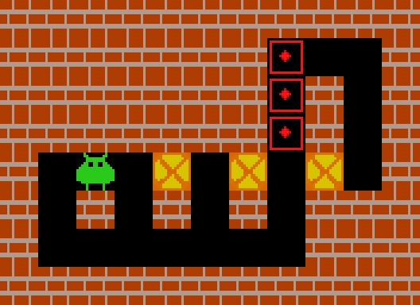
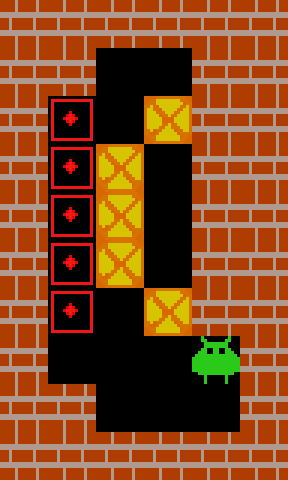
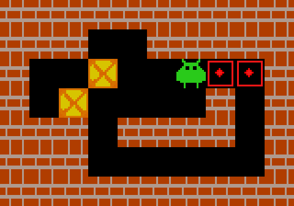

# Sokoban Solver

A small Python project for solving and visualizing Sokoban puzzles. It includes
a push-based breadth-first solver, a random baseline, and all 155 Microban
levels.

## Demo

| Microban 10<br>121 moves                                 | Microban 35<br>97 moves                                  | Microban 50<br>88 moves                                  |
| -------------------------------------------------------- | -------------------------------------------------------- | -------------------------------------------------------- |
|  |  |  |

## Setup

This project uses [uv](https://docs.astral.sh/uv/):

```bash
uv sync
uv run pytest
```

## Usage

Solve and visualize the first Microban level:

```bash
uv run sokoban-solver
```

Choose a level or solver:

```bash
uv run sokoban-solver --level 5
uv run sokoban-solver --solver random --seed 7 --max-steps 300
uv run sokoban-solver --no-render --solver bfs --level 1
```

Benchmark one or more levels without rendering:

```bash
uv run sokoban-benchmark --heuristic manhattan --max-expansions 1000000
uv run sokoban-benchmark --level 1 --level 5
```

The benchmark reports solution length, expanded states, peak queue size, and
timing statistics. Levels that reach the expansion limit do not stop the run.
